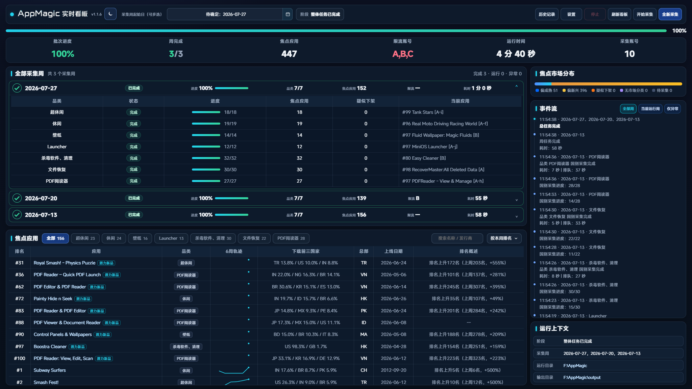
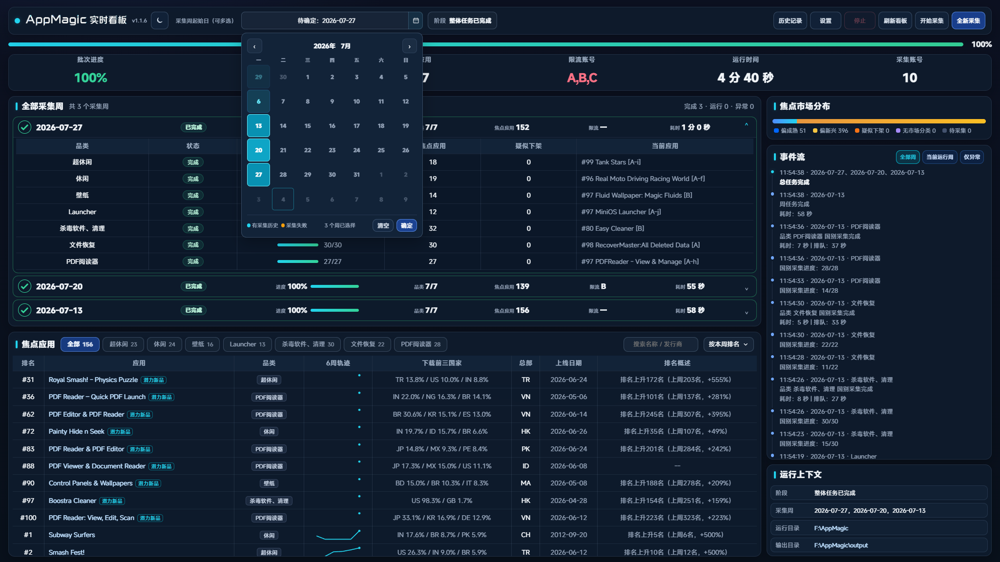
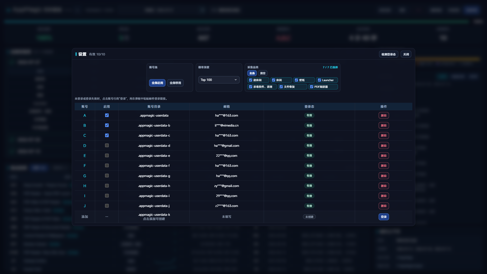
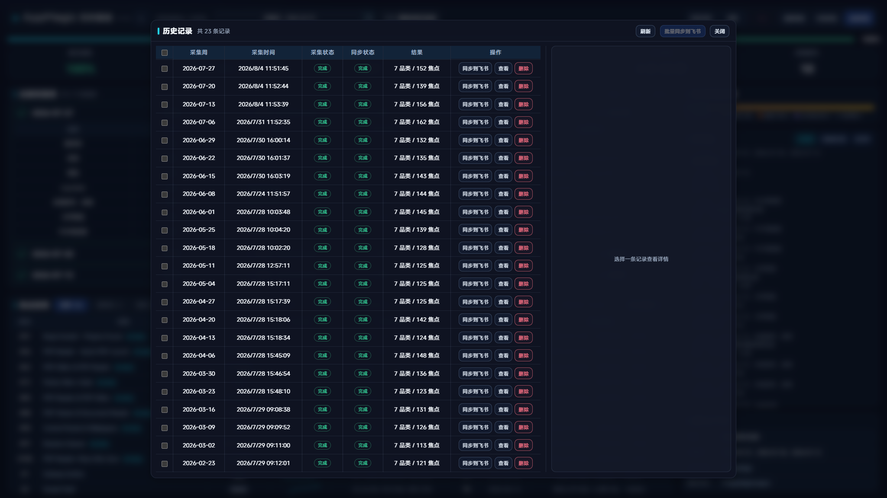

# AMDC（AMDC Data Collection）

当前版本：`1.1.8`。面向应用市场研究的 AMDC（数据采集）周榜采集工具。项目支持多账号和多周批量采集，多周任务按采集周从新到旧依次执行，每周由全部已选账号共同处理该周任务。用户通过本地实时看板查看榜单进度、重点关注应用、排名变化和市场分布，并可导出 Excel 或同步到飞书电子表格。



## 主要功能

- 同时采集超休闲、休闲、壁纸、Launcher、杀毒软件与清理、文件恢复、PDF 阅读器七个品类。
- 在日历中多选历史周一；任务按最新周到最旧周依次执行，每周由全部已选账号共同采集，不分配为“一周一个账号”；当前周和未来周不可选择。
- 支持缓存采集和全新采集。缓存采集发现榜单与历史排名不一致时，会自动切换为全新采集。
- 看板按采集周固定展示数据，包含品类进度、重点关注应用、本周飙升榜、焦点市场分布、事件流和运行上下文。
- 账号实时认证状态用绿灯“正常”、黄灯“异常”、红灯“失效”表示，设置页和看板中的邮箱统一脱敏。
- 历史记录按采集批次保存；同一采集周的多次启动保留为独立记录，并标记定时或手动来源；可查看结果、删除记录、单条或批量同步到飞书。
- Excel 和飞书表格统一控制字号、列宽、超链接、品类颜色及日期工作表顺序。

### 功能页面

| 采集周选择 | 设置与品类 | 历史记录 |
|---|---|---|
|  |  |  |

## 快速开始

### Linux / WSL

```bash
curl -fsSL https://gitee.com/Hawkiethehawk/AMDC/raw/master/scripts/deploy.sh | bash
```

### Windows PowerShell

```powershell
irm https://gitee.com/Hawkiethehawk/AMDC/raw/master/scripts/deploy.ps1 | iex
```

默认安装到当前目录。可通过 `AMDC_INSTALL_DIR` 环境变量自定义。

## 环境要求

- **Node.js** >= 18
- **Python 3** + `openpyxl`（Excel 导出）
- **Linux/WSL**: `libnspr4` `libnss3` `libasound2`（Playwright Chromium 依赖，部署脚本自动安装）；需要 X Server 以显示浏览器窗口
- **Windows**: 无需额外系统库，Playwright 开箱即用

## 命令一览

| 命令 | 说明 |
|------|------|
| `amdc setup` | 安装依赖 + 生成配置文件 |
| `amdc login [profile]` | 浏览器登录指定 AMDC 账号 profile |
| `amdc status` | 实时检查登录状态，显示状态灯和脱敏邮箱 |
| `amdc check` | 仅检查 auth token 是否有效 |
| `amdc export` | 仅 Excel 导出（已有数据） |
| `amdc dashboard` | 启动本地网页看板 |
| `amdc start` | 后台启动看板 |
| `amdc stop` | 停止看板 |
| `amdc restart` | 重启看板 |
| `amdc tags update` | 更新 AMDC tag 字典 |
| `amdc schedule init` | 生成定时调度任务 |
| `amdc schedule remove` | 移除定时调度任务 |
| `amdc config show` | 显示当前配置 |
| `amdc update` | 拉取最新版本、安装依赖并自动重启看板 |

## 多账号管理

支持最多 20 个独立登录 profile（A~T，对应 `.amdc-userdata` 到 `.amdc-userdata-t`），各自维护独立登录态。看板可以选择启用的账号池，采集 Worker 上限随账号池绑定，默认和最大值均为 20。

**Linux/WSL:**
```bash
AMDC_EMAIL=user_a@example.com amdc login
AMDC_EMAIL=user_b@example.com AMDC_USERDATA_DIR=.amdc-userdata-b amdc login
```

**Windows PowerShell:**
```powershell
$env:AMDC_EMAIL="user_a@example.com"; amdc login
$env:AMDC_EMAIL="user_b@example.com"; $env:AMDC_USERDATA_DIR=".amdc-userdata-b"; amdc login
```

登录后 `amdc status` 会先执行实时认证探针，再显示所有 profile 的登录状态；邮箱以脱敏形式显示，状态分别为绿灯“正常”、黄灯“异常”和红灯“失效”。

## 网页看板

```bash
amdc dashboard  # 前台启动
amdc start      # 后台启动
amdc stop       # 停止
amdc restart    # 重启看板
```

看板默认监听 Windows 的 `127.0.0.1:8787`，WSL 的 `0.0.0.0:8788`，可通过 `AMDC_HOST` 和 `AMDC_PORT` 环境变量修改：

```bash
AMDC_PORT=9999 amdc dashboard
```

在顶部日历中选择一个或多个历史周一并点击“确定”，再到“设置”中选择账号、榜单深度和采集品类。未确认采集周时不能启动任务。点击“开始采集”会优先复用缓存；点击“全新采集”会重新请求全部数据。服务端会再次校验登录态、采集周、榜单深度、品类和账号 profile，不依赖浏览器端参数。

批量采集时，“当前采集周”下拉框决定看板展示哪一周，页面中的品类进度、重点关注应用、飙升榜和市场分布会保持在所选周，不会随其他周任务切换。

看板顶部“历史记录”可查看最新运行的时间、采集周、运行状态和结果摘要。每次采集会独立保存在 `Cache/history/<run-id>/`，历史页按采集周只保留最新记录；不使用数据库。只有不存在现代运行记录的采集周，旧版 `Cache/<YYYYMMDD>/` 缓存才会作为只读兼容记录显示。

前端手动采集完成后，历史记录中的“同步到飞书”需要人工确认。Windows 定时任务则由看板自动同步飞书，并在同一条历史记录中更新同步状态。批量同步最多同时执行两个任务，支持停止和事务回滚；执行期间同步按钮会被冻结，进度条按全部所选采集周汇总展示。同步会覆盖对应日期工作表的旧内容，清理残留临时工作表；工作表不存在时自动创建，并按日期递减排列，最近日期位于最左侧。

历史记录表头复选框首次点击会选择所有可同步且状态为“未同步”或“同步失败”的记录，再次点击清空选择；未完成、旧版、同步中和排队同步的记录不会被选入。

榜单深度默认 `Top 100`。日期控件及服务端都只接受周一。

看板任务的 JSON、进度和临时文件保存在独立历史目录 `Cache/history/<run-id>/`；按采集周共享的榜单和富化缓存保存在 `Cache/<YYYYMMDD>/`，仅在没有现代运行记录时作为只读兼容历史显示。唯一交付文件为 `output/AMDC-<YYYYMMDD>.xlsx`，其中 `YYYYMMDD` 是采集周的周一；Linux/WSL 定时包装器的运行日志保存在项目根目录 `logs/`。

## 配置

配置文件 `amdc-config.json` 存放在项目根目录，`amdc setup` 自动生成。配置支持账号列表、榜单深度、Worker 上限、认证并发、采集间隔和通知等选项，环境变量优先于配置文件。示例见 `references/amdc-config.example.json`。

## 定时调度

调度脚本位于 `schedules/` 目录。Windows 定时任务由本机看板统一编排，不直接运行采集 Worker。

Linux/WSL:

```bash
0 9 * * 1 /path/to/AMDC/schedules/weekly-run.sh
```

### Windows Task Scheduler

```powershell
schtasks /create /xml "schedules\weekly-run.xml" /tn "AMDC Weekly"
```

默认任务每周三 09:30 运行。`run_amdc_scheduled.ps1` 会读取本机时间，计算上周周一作为采集周，例如 2026 年 8 月 5 日运行时采集 `2026-07-27`。它先检查 `http://127.0.0.1:8787` 的看板健康状态；看板未运行时，会无头启动看板并等待健康检查通过，再请求定时入口。

看板会依次完成账号登录态检查、七品类缓存采集、Excel 生成、飞书同步和 ntfy 通知。只有来源为 `scheduled` 的定时批次在采集与飞书同步全部成功后，才会异步触发一次 `F:\AMTools\skills\AMDA` 的 Demo 更新；手动采集、补采和手动飞书同步不会触发。定时 AMDA 自动纳入固定工作簿内全部可见、日期命名的周度工作表，不再等待手动日期确认；每个批次只创建一个 `AM-Demo-yyyymmdd` Demo，并固定使用该地址重试。AMDA 只生成并校验 Demo 草稿，正式市场分析文档保持只读。通知统一发送到 `appmagic` 主题，共六个 AMDC 阶段及 AMDA 更新状态，AMDA 通知保留本阶段耗时。

定时包装器日志写入 `logs/scheduled-run.log`。专用本机令牌首次启动看板时生成到被 Git 忽略的 `amdc-config.json` 的 `schedule.apiToken`，不需要写入 XML、环境变量或仓库。

AMDA 触发日志和每个定时批次的状态文件写入 `logs/amda-update.log` 与 `logs/amda-triggers/`。触发器使用批次 ID 去重，避免同一批次重复启动 AMDA。

`weekly-run.sh` 会自动选择 `pwsh`、`powershell.exe` 或 `powershell`。在 WSL 中调用 Windows PowerShell 时会自动用 `wslpath` 转换路径。无人值守运行可以通过这些环境变量覆盖行为：

| 环境变量 | 说明 |
|------|------|
| `AMDC_PROJECT_DIR` | 项目根目录，默认按脚本所在仓库推导 |
| `AMDC_HOST` | 看板监听地址；Windows 默认 `127.0.0.1`，WSL 默认 `0.0.0.0` |
| `AMDC_PORT` | 看板端口 |
| `AMDC_POWERSHELL` | 指定 PowerShell 可执行文件 |
| `WEEK_ANCHOR` | 指定周一日期，格式 `YYYY-MM-DD` |
| `AMDC_CATEGORIES` | JSON 品类数组；未设置时使用七个默认品类 |
| `AMDC_ACCOUNTS` | 逗号分隔的账号 profile 目录 |
| `TOP_DEPTH` | 榜单深度，仅支持 `100` 或 `1000` |
| `AMDC_MAX_WORKERS` | 应用数据 Worker 数量，范围 `1`~`20` |
| `AUTH_CHECK_CONCURRENCY` | 账号认证并发数，范围 `1`~`20` |
| `FRESH=1` | 忽略缓存重新采集 |
| `LIST_ONLY=1` | 仅列出可采集项 |
| `EXPORT_ONLY=1` | 只导出已有 JSON 到 Excel |
| `SKIP_EXCEL=1` | 跳过 Excel 导出 |

## 目录结构

```
AMDC/
├── am.js                  # CLI 入口
├── package.json
├── scripts/
│   ├── deploy.sh          # 一键部署 (Linux/WSL)
│   ├── deploy.ps1         # 一键部署 (Windows PowerShell)
│   ├── amdc_feishu_sync.py # 飞书工作表同步
│   ├── amdc_profile_emails.ps1 # profile 邮箱检查
│   ├── amdc-weekly.js # 核心采集引擎
│   ├── amdc-login.js  # 浏览器登录
│   ├── amdc_tags_dict.js  # Tag 字典管理
│   ├── collection-plan.js     # 多周与账号队列规划
│   ├── amdc_xlsx.py       # Excel 生成
│   ├── amdc_xlsx_common.py
│   ├── amdc_xlsx_merged.py
│   ├── dashboard_contract_test.js # 看板契约测试
│   ├── feishu_sheet_order_test.py # 飞书工作表排序测试
│   ├── history-sync-progress.js   # 批量同步进度聚合
│   ├── notify.js          # 通知
│   ├── postinstall.js     # 安装后自检
│   ├── progress-server.js # Dashboard 服务
│   ├── run_amdc_scheduled.ps1 # Windows 定时任务无头入口
│   ├── run_amda_after_amdc.ps1 # 定时 AMDC 完成后的 AMDA Demo 触发器
│   ├── validate.js        # 数据校验
│   └── run_amdc_weekly.ps1  # 采集入口，兼容 Windows PowerShell / PowerShell 7 / WSL
├── references/
│   ├── amdc-config.example.json
│   └── amdc-tags-full.json
└── schedules/
    ├── weekly-run.sh      # Linux/WSL crontab 模板
    └── weekly-run.xml     # Windows Task Scheduler 模板
```

## License

UNLICENSED — 私有项目，保留所有权利。
